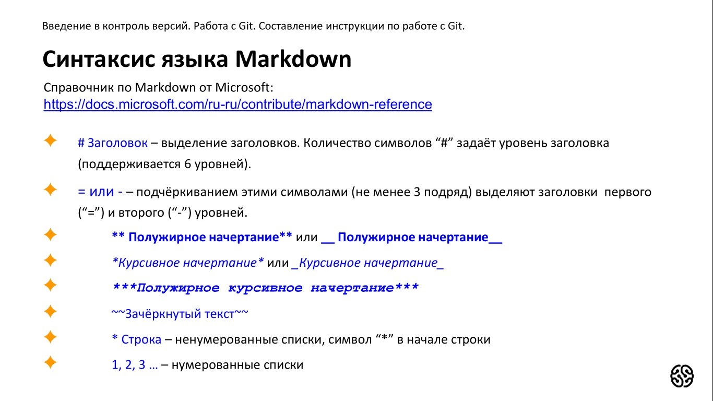
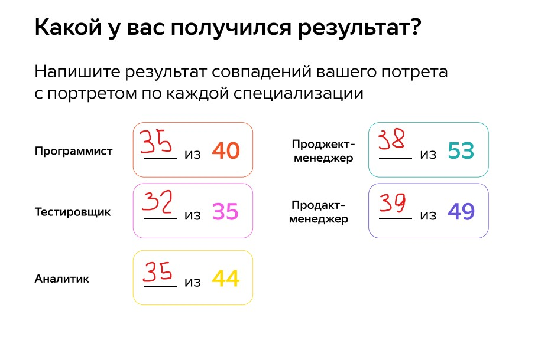

# Порядок работы с гит.
==============================================================
1. Создаем папку на рабочем столе.
2. Открываем её в VSC.
3. Используя сочетание клавиш "Ctrl+`" открываем терминал.
4. Инициализируем локальный репозиорий с помощью команды **git init**.
5. Создаем файл в папке (в нашем случае файл с расширением .md)
6. Проверяем состояние Git командой **git status**.
7. Сохраняем "Ctrl+S" и добавляем файл командой **git add**.
8. Создаем коммит с помощью **git commit -m "коментарий к коммиту"**.
## Примечание
------------------------
* Для того чтобы увидеть журнал коммитов используй команду **git log** или **git log --oneline (для более компактного отображения)**.
* Для перехода между коммитами используй **git checkout**.
* Чтобы вернуться на главную ветку используй **git checkout master**.
* Чтобы увидеть разницу между текущим файломи закоммиченным используй **git diff**. 
## Команды для работы с терминалом BASH
--------------------
* Создание директории 
**mkdir [dir-name]**.
* Список файлов включая скрытые
**ls -a**.
* Создание файла 
**touch [file-name]**.
* Содержимое файла 
**cat [file-name]**.
* Создание или перезапись файла 
**echo [string] > [file-name]**.
* Добавление строки в файл 
**echo [string] >> [file-name]**.
* Смена директории: 
    1. **cd [dir-name]**.
    2. Родительская директория **cd ..** .
    3. На два уровня выше **cd ../..** .
    4. Предыдущая директория **cd -** .
    5. Домашняя директория **cd ~** . 
## Синтаксис языка MarkDown
-----------------------

## Колесо компетенций
1. Экстраверт = 3
2. Интроверт = 0
3. Способность к монотонной работе = 5
4. Наставничество = 3
5. Аналитические навыки = 3
6. Эмпатия = 5
7. Любопытство = 5
8. Ораторское искусство = 2
9. Организаторские способности = 4
10. Критическое мышление = 4
11. Многозадачность = 2
12. Креативность = 1
13. Стрессоустойчивость = 2
14. Контроль времени = 4
15. Работа с большим объемом информации = 3

## Результаты колеса компетенций

